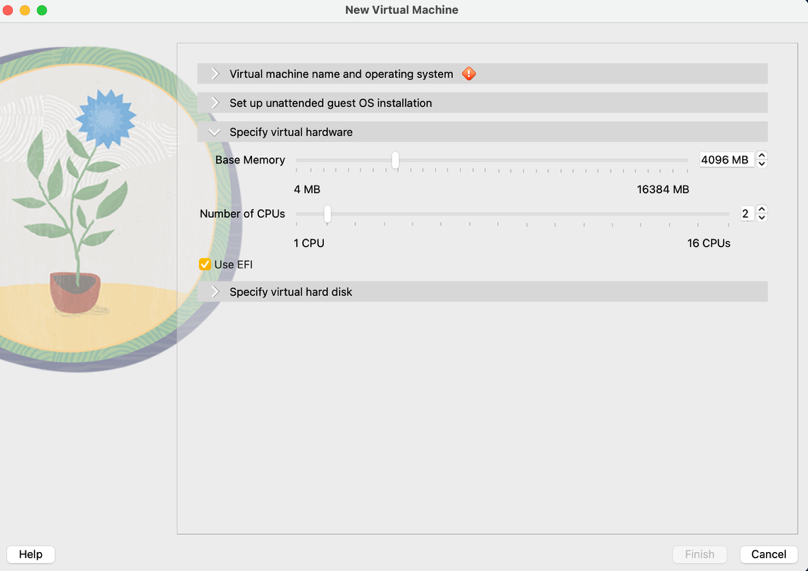
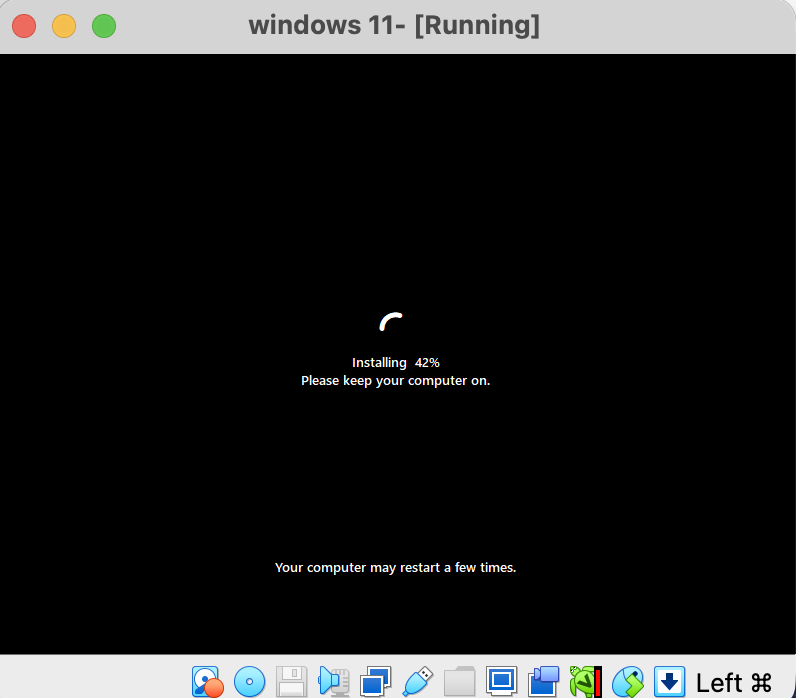
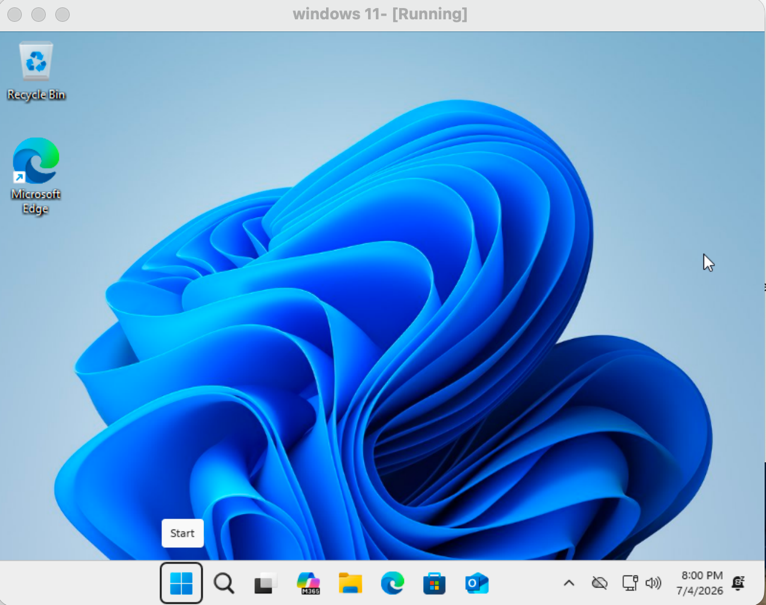
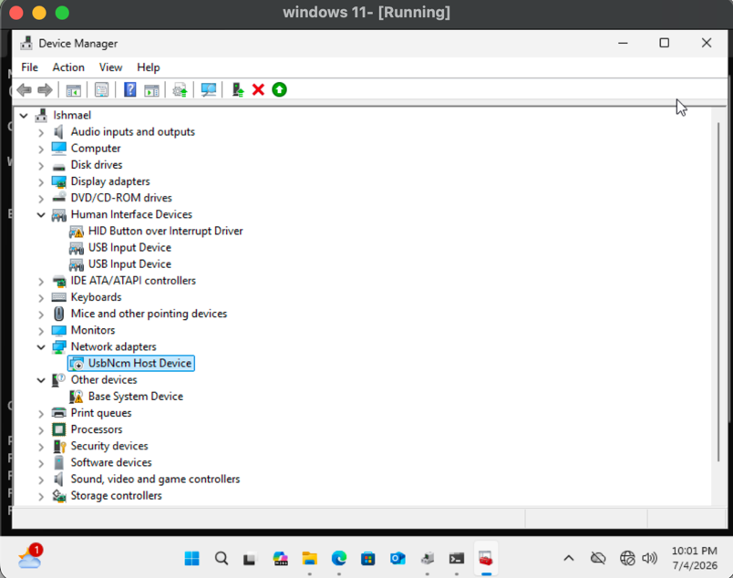
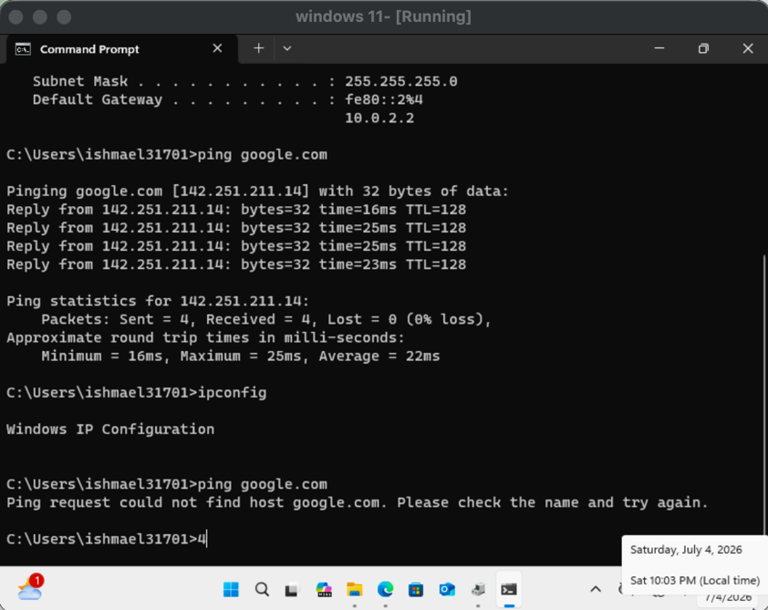
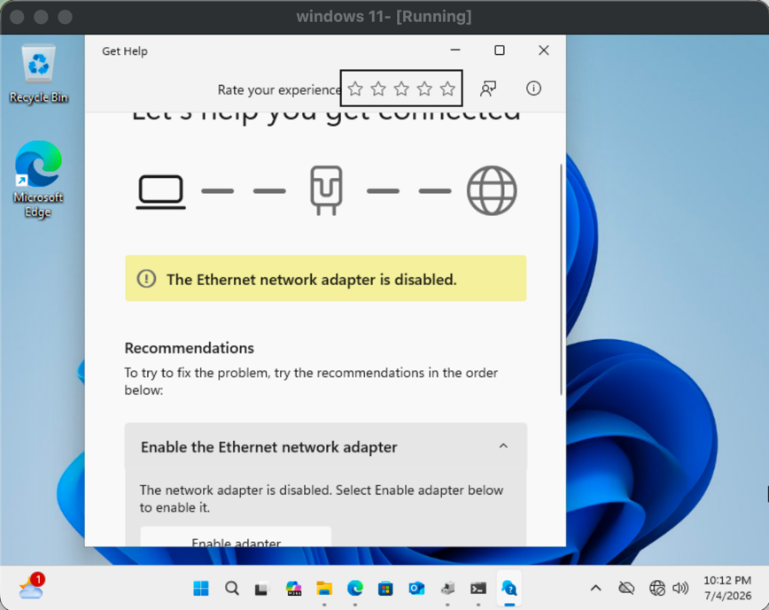
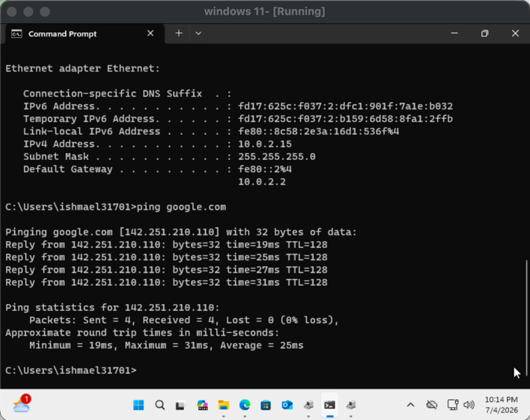

# Lab 01: Windows 11 Client — Install & Troubleshooting

## Objective

Install Windows 11 on a virtual machine and demonstrate basic client-side troubleshooting skills.

## Environment

- **Hypervisor:** VirtualBox (Apple Silicon build)
- **Guest OS:** Windows 11 ARM64
- **Host:** MacBook, Apple M3, 16GB RAM

## Part 1: Installation

1. Created a new VM in VirtualBox with 80GB of RAM, 16 CPUs
2. Mounted the Windows 11 ARM64 ISO to the virtual optical drive
3. Walked through Windows Setup (language, edition, custom install, no product key)
4. Completed OOBE using a local account

### Screenshots

*VM hardware allocation*

*Windows Setup mid-install*

*Desktop after first successful login*

## Part 2: Troubleshooting

### Scenario: Network Adapter Failure

**Problem:** Disabled the network adapter via Device Manager to simulate a loss of connectivity.

**Diagnosis:**
- Ran `ipconfig` — no IP address returned
- Ran `ping google.com` — request timed out
- Ran Windows Network Troubleshooter — correctly identified the disabled adapter

**Resolution:**
- Re-enabled the adapter in Device Manager
- Ran `ipconfig /renew` to reacquire an IP address
- Confirmed connectivity with `ping google.com` — received successful replies

### Screenshots

*Device Manager, adapter disabled*

*Failed ping/ipconfig output*

*Network Troubleshooter identifying the issue*

*Adapter re-enabled, successful ping*
